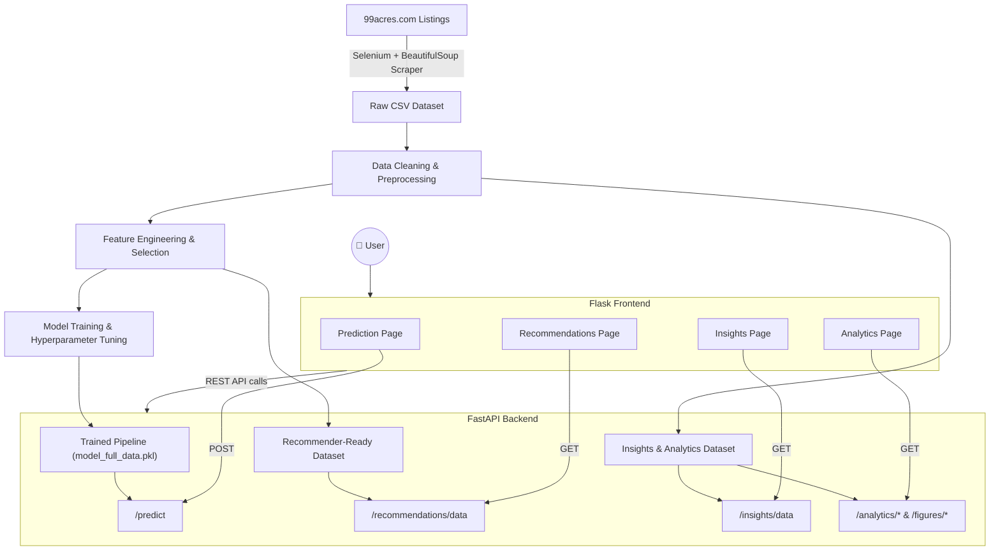

<div align="center">

# 🏡 Estatify

### AI-Powered Real Estate Analytics & Price Intelligence Platform

*Turning raw property listings into predictions, recommendations, and market insight — for Gandhinagar's real estate market.*

[](https://www.python.org/)
[](https://fastapi.tiangolo.com/)
[](https://flask.palletsprojects.com/)
[](https://scikit-learn.org/)
[](#-license)

</div>

---

## 🚀 Live Demo

**🌐 Frontend:** https://real-estate-final.onrender.com/

**📚 Backend API (Swagger Docs):** https://real-estate-1-l00c.onrender.com/docs


---

## 📖 Overview

**Estatify** is an end-to-end, AI-powered real estate analytics system built around property listings scraped from **99acres.com** for the **Gandhinagar** real estate market. The project takes raw, messy listing data all the way through cleaning, feature engineering, exploratory analysis, and machine learning — and ships it as a **production-style web application** with a decoupled architecture:

- A **FastAPI backend** that serves a trained price-prediction model, a content-based property recommender, and a suite of Plotly-powered analytics endpoints.
- A **Flask frontend** that consumes the backend API and renders an interactive, multi-page web experience for predicting prices, exploring recommendations, and browsing market analytics.

The repository also includes the **full data science workflow** as Jupyter notebooks — scraping, cleaning, EDA, feature selection, model selection, hyperparameter tuning, and the recommendation engine — so the entire pipeline from raw HTML to deployed model is transparent and reproducible.

---

## ✨ Key Features

| | Feature | Description |
|---|---|---|
| 💰 | **Price Prediction** | Predicts a property's price (in ₹ Lakhs) from area, rooms, floor, location, and other attributes, with a 95% confidence interval and market segment classification (Affordable / Premium / Luxury). |
| 🧭 | **Property Recommendation Engine** | Content-based recommender using **cosine similarity** over normalized property features to suggest similar listings. |
| 📊 | **Market Insights Dashboard** | Aggregated numerical and categorical statistics of the property market, served from a pre-computed insights dataset. |
| 🗺️ | **Spatial Price Analysis** | Interactive map visualizing average price and price-per-sq-ft across mapped localities using latitude/longitude coordinates. |
| 📈 | **Price vs. Area Trends** | Scatter and segment visualizations showing how price scales with area, BHK configuration, and property age. |
| 🏘️ | **Locality Market Share & Segmentation** | Breakdown of listings by locality, property status (Ready to Move / Under Construction), and market segment (Affordable / Premium / Luxury). |
| ☁️ | **Amenities & Nearby Facilities Word Clouds** | Visual frequency analysis of amenities and nearby landmarks mentioned in listings. |
| 🔍 | **Feature Importance Analysis** | Standalone script analyzing which features drive property price the most. |
| ⚙️ | **REST API** | A fully documented FastAPI backend exposing prediction, analytics, recommendation, and chart-generation endpoints. |

---

## 🖼️ Screenshots

<div align="center">

## 📸 Application Screenshots

| Home | Price Prediction |
|:---:|:---:|
| .png) | .png) |

| Market Insights | Market Analysis |
|:---:|:---:|
| .png) | .png) |

| Recommendation Engine |
|:---:|
| .png) |

</div>

---

## 🛠️ Tech Stack

### Frontend


### Backend


### Machine Learning


### Data Collection & Wrangling


### Deployment


> ℹ️ The backend and frontend are deployed as two independent services (a common pattern for FastAPI + Flask split architectures), currently hosted on **Render**.

---

## 🧱 Project Architecture



---

## 📂 Folder Structure

```
Real_Estate/
├── backend/
│   ├── app.py                  # FastAPI app: prediction, analytics & recommendation endpoints
│   ├── insights_data.json      # Pre-computed numerical & categorical market insights
│   └── models/
│       └── model_full_data.pkl # Trained ExtraTreesRegressor pipeline
│
├── frontend/
│   ├── main.py                 # Flask app: routes that proxy to the FastAPI backend
│   ├── requirements.txt        # Frontend dependencies
│   ├── templates/              # Jinja2 templates (index, prediction, recommendations, analytics, insights)
│   └── static/
│       ├── css/                # Stylesheets (style.css, insights.css)
│       ├── js/                 # Client-side scripts (predict.js, analytics.js, insights.js, animations.js)
│       └── images/             # Logo & generated word cloud images
│
├── data/
│   ├── gandhinagar_property_raw.csv                     # Raw scraped listings
│   ├── gandhinagar_property_processed.csv                # Cleaned dataset
│   ├── gandhinagar_property_apartments_cleaned.csv        # Cleaned apartment subset
│   ├── gandhinagar_property_apartments_final.csv          # Final modeling dataset
│   ├── gandhinagar_property_apartments_recommender_ready.csv # Dataset used by the recommender
│   ├── gandhinagar_property_feature_selection.csv         # Feature-selection working set
│   ├── gandhinagar_property_apartments_model_insights.csv # Model evaluation samples
│   ├── gandhinagar_property_houses.csv                     # Houses subset
│   ├── gandhinagar_property_plots.csv                      # Plots subset
│   ├── location_counts.csv                                # Locality frequency counts
│   └── test.csv
│
├── notebooks/
│   ├── Scraper.ipynb                          # 99acres scraper (Selenium + BeautifulSoup)
│   ├── Data_Preprocessing.ipynb               # Cleaning & preprocessing pipeline
│   ├── Outliers_and_Missing_values.ipynb      # Outlier & missing-value handling
│   ├── EDA_Univariate.ipynb                   # Univariate exploratory analysis
│   ├── EDA_Multivariate.ipynb                 # Multivariate exploratory analysis
│   ├── Feature_Engineering.ipynb              # Feature engineering
│   ├── Feature_Selection.ipynb / _v2.ipynb    # Feature selection experiments
│   ├── Baseline_Model.ipynb                   # Baseline regression models
│   ├── Model_Selection_and_Hyperparameter.ipynb # Model comparison & tuning (final model)
│   ├── Model_Insights.ipynb                   # Model interpretability
│   ├── Classifier.ipynb                       # Market-segment classification experiments
│   ├── OD_Recommender_Preprocessing.ipynb     # Recommender data preparation
│   ├── Recommendation_Engine.ipynb            # Recommendation engine development
│   └── Analytics_Dashboard.ipynb              # Analytics dashboard prototyping
│
├── Feature_Importance.py       # Standalone feature-importance analysis script
├── Insights.py                 # Standalone market insights generation script
├── Recommeder.py                # Standalone Dash-based recommender prototype
└── requirements.txt             # Backend / ML dependencies
```

---

## 🤖 Machine Learning Pipeline & Model Information

The end-to-end ML workflow (visible across the `notebooks/` folder) follows these stages:

1. **Data Collection** — Property listings scraped from **99acres.com** for Gandhinagar using Selenium and BeautifulSoup (`Scraper.ipynb`).
2. **Cleaning & Preprocessing** — Handling missing values, outliers, and inconsistent categorical labels (`Data_Preprocessing.ipynb`, `Outliers_and_Missing_values.ipynb`).
3. **EDA** — Univariate and multivariate exploration of price drivers (`EDA_Univariate.ipynb`, `EDA_Multivariate.ipynb`).
4. **Feature Engineering & Selection** — Deriving and selecting the most predictive features (`Feature_Engineering.ipynb`, `Feature_Selection.ipynb`, `Feature_Selection_v2.ipynb`).
5. **Model Selection** — Benchmarking multiple regressors — **Extra Trees, Random Forest, Gradient Boosting, CatBoost, LightGBM, XGBoost, and SVR** — via 10-fold cross-validation (`Model_Selection_and_Hyperparameter.ipynb`).
6. **Hyperparameter Tuning** — Grid/random search tuning of the best-performing model.
7. **Deployment** — The final pipeline is serialized with `joblib` and served by the FastAPI backend.

### Final Model Pipeline

```python
Pipeline(steps=[
    ('preprocessor', ColumnTransformer([
        ('num', StandardScaler(), ['Area', 'Bathrooms', 'Balconies',
                                    'Current_Floor', 'Total_Floors', 'Bedrooms']),
        ('cat', TargetEncoder(), ['Mapped_Area', 'Property_Age', 'Furnishing_Status',
                                   'Area_Type', 'Property_Status', 'Facing'])
    ])),
    ('regressor', ExtraTreesRegressor(
        n_estimators=350,
        max_depth=25,
        min_samples_split=7,
        max_features=None,
        random_state=42
    ))
])
```

- The target variable is **log-transformed** during training and inverted with `np.expm1` at inference time.
- **Prediction intervals** at request time are derived from the spread of predictions across the individual trees in the `ExtraTreesRegressor` ensemble (5th–95th percentile).
- Predictions are further tagged with a **market segment** (`Affordable` / `Premium` / `Luxury`) based on price thresholds.

### Model Performance

Evaluated on a held-out test split (log-target, converted back to ₹ Lakhs):

| Metric | Score |
|---|---|
| **R² Score** | 0.879 |
| **MAE** | ₹14.42 Lakhs |
| **RMSE** | ₹25.69 Lakhs |
| **Best CV MAE** (log scale) | 0.1576 |

Model comparison from cross-validation (`Model_Selection_and_Hyperparameter.ipynb`):

| Model | CV R² | Test R² | MAE | RMSE |
|---|---|---|---|---|
| **Extra Trees** ⭐ | 0.859 | 0.874 | 14.64 | 23.01 |
| Random Forest | 0.863 | 0.872 | 15.25 | 25.40 |
| CatBoost | 0.864 | 0.865 | 15.52 | 24.14 |
| Gradient Boosting | 0.849 | 0.852 | 15.75 | 25.34 |
| XGBoost | 0.849 | 0.862 | 15.86 | 25.52 |
| LightGBM | 0.850 | 0.854 | 16.75 | 28.53 |
| SVR | 0.829 | 0.838 | 17.24 | 26.85 |

**Extra Trees Regressor** was selected as the final model for its consistently low error and strong generalization.

---

## 🔌 API Reference

The FastAPI backend (`backend/app.py`) exposes the following endpoints:

| Method | Endpoint | Description |
|---|---|---|
| `GET` | `/` | Health check / welcome message |
| `GET` | `/health` | Reports whether the ML model is loaded |
| `POST` | `/predict` | Predicts property price from input features |
| `GET` | `/analytics/areas` | Aggregated price/area stats per locality |
| `GET` | `/analytics/map` | Full analytics payload (maps, charts, metrics, word clouds) |
| `GET` | `/recommendations/data` | Property recommendation dataset |
| `GET` | `/insights/data` | Pre-computed numerical & categorical market insights |
| `GET` | `/figures/price-area` | Price vs. area scatter chart (Plotly JSON) |
| `GET` | `/figures/bhk-distribution?locality=` | BHK distribution chart, optionally filtered by locality |
| `GET` | `/figures/bhk-price` | BHK vs. price comparison chart |
| `GET` | `/data/localities` | List of all available mapped localities |

### Example — Predict Price

**Request**

```bash
curl -X POST "https://real-estate-1-l00c.onrender.com/predict" \
  -H "Content-Type: application/json" \
  -d '{
    "Area": 1250,
    "Bathrooms": 2,
    "Balconies": 2,
    "Current_Floor": 3,
    "Total_Floors": 8,
    "Furnishing_Status": "Semi-Furnished",
    "Mapped_Area": "Kudasan",
    "Facing": "East",
    "Property_Age": "1-5 years",
    "Bedrooms": 3,
    "Area_Type": "Super Built-up",
    "Property_Status": "Ready_to_Move"
  }'
```

**Response**

```json
{
  "predicted_price_lakhs": 78.35,
  "price_range_95_ci": {
    "lower": 69.21,
    "upper": 88.47
  },
  "model_confidence": 95,
  "price_per_sqft": 6268,
  "market_segment": "Premium"
}
```

> Interactive Swagger docs are auto-generated by FastAPI and available at `/docs` on the backend URL.

---

## ⚙️ Installation & Local Setup

### Prerequisites
- Python 3.10+
- `pip` and a virtual environment tool (`venv`)

### 1. Clone the repository

```bash
git clone https://github.com/MeghOfficial/Real_Estate.git
cd Real_Estate
```

### 2. Backend Setup (FastAPI)

```bash
python -m venv venv
source venv/bin/activate        # On Windows: venv\Scripts\activate

pip install -r requirements.txt

cd backend
uvicorn app:app --reload --port 8000
```

The API will be available at `http://127.0.0.1:8000` (Swagger docs at `http://127.0.0.1:8000/docs`).

### 3. Frontend Setup (Flask)

In a new terminal:

```bash
cd frontend
pip install -r requirements.txt
```

> ⚠️ Update the `API_BASE` variable at the top of `frontend/main.py` to point to your local backend (`http://127.0.0.1:8000`) if you are not using the deployed one.

```bash
python main.py
```

The frontend will be available at `http://127.0.0.1:5000`.

---

## 🚀 Deployment

Estatify uses a **split-service deployment** — the FastAPI backend and Flask frontend are deployed independently, currently on **Render**.

### Backend (FastAPI)
1. Push the repository to GitHub.
2. Create a new **Web Service** on Render pointing to the repo root.
3. Build command: `pip install -r requirements.txt`
4. Start command:
   ```bash
   uvicorn backend.app:app --host 0.0.0.0 --port $PORT
   ```

### Frontend (Flask)
1. Create a second **Web Service** on Render, using `frontend/requirements.txt`.
2. Start command (via `gunicorn`, already included in dependencies):
   ```bash
   gunicorn main:app
   ```
3. Set `API_BASE` in `frontend/main.py` (or via environment variable) to the deployed backend URL.

---

## 🧑‍💻 How to Use the Application

1. **Home** — Landing page introducing the platform.
2. **Prediction** (`/prediction`) — Fill in property details (area, bedrooms, bathrooms, floor, locality, furnishing, etc.) to get an instant AI-generated price estimate with a confidence range and market segment.
3. **Recommendations** (`/recommendations`) — Browse similar properties suggested by the content-based recommendation engine.
4. **Analytics** (`/analytics`) — Explore an interactive dashboard: locality price maps, price-vs-area trends, BHK distributions, market segmentation, and amenity/nearby-facility word clouds.
5. **Insights** (`/insights`) — View aggregated numerical and categorical statistics summarizing the overall property market.

---

## 🗃️ Dataset Information

- **Source:** Property listings scraped from **[99acres.com](https://www.99acres.com/)** for the **Gandhinagar** region, using Selenium and BeautifulSoup.
- **Raw dataset:** 1,884 listings, 15 columns (`gandhinagar_property_raw.csv`).
- **Final modeling dataset:** 1,304 apartment listings, 13 features (`gandhinagar_property_apartments_final.csv`) after cleaning, outlier removal, and filtering to the apartment segment.
- **Features used for prediction:** `Area`, `Bathrooms`, `Balconies`, `Current_Floor`, `Total_Floors`, `Bedrooms`, `Furnishing_Status`, `Mapped_Area`, `Facing`, `Property_Age`, `Area_Type`, `Property_Status`.
- **Additional derived datasets:** separate CSVs for houses and plots, a recommender-ready dataset, a feature-selection working set, locality frequency counts, and model evaluation samples.

---

## 🔮 Future Improvements

- [ ] Add authentication and saved favorites/watchlists for users
- [ ] Expand data collection beyond Gandhinagar to neighboring regions
- [ ] Add automated periodic re-scraping and model retraining pipeline
- [ ] Extend the platform to support accurate price prediction and recommendations for independent houses, villas, and residential plots in addition to apartments
- [ ] Add unit/integration tests for backend endpoints
- [ ] Containerize both services with Docker for consistent deployment
- [ ] Add CI/CD pipeline (GitHub Actions) for automated testing and deployment
---

## 🤝 Contributing

Contributions are welcome! To contribute:

1. **Fork** the repository
2. Create a new branch: `git checkout -b feature/your-feature-name`
3. Commit your changes: `git commit -m "Add some feature"`
4. Push to the branch: `git push origin feature/your-feature-name`
5. Open a **Pull Request**

Please open an issue first to discuss significant changes.

---

## 📄 License

This project is licensed under the **MIT License**. Feel free to use, modify, and distribute it with attribution.

---

## 👤 Author

<div align="center">

**Megh Patel**

[](https://github.com/MeghOfficial/Real_Estate)
[](https://www.linkedin.com/in/megh-bavarva-588b78284/)
[](mailto:bavarvamegh3139@gmail.com)

⭐ If you found this project useful, consider giving it a star!

</div>
